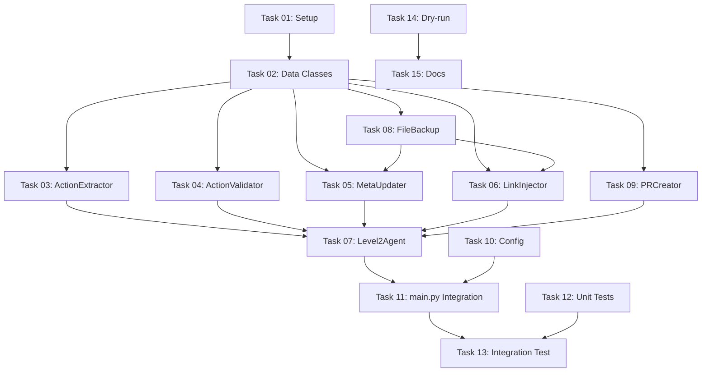

# Tasks: PR Automation Implementation

**Feature**: pr-automation
**Created**: 2026-01-11
**Status**: Ready for Implementation
**Spec**: [spec.md](./spec.md)
**Plan**: [plan.md](./plan.md)

---

## Overview

**Total Tasks**: 15
**Estimated Complexity**: Medium-High
**Critical Path**: Task 1 → 2 → 3 → 7 → 11 → 13

---

## Dependency Graph

---

## Task List

### TASK-01: Project Setup & Dependencies
**Priority**: HIGH
**Complexity**: Low
**Dependencies**: None
**Estimated Time**: 30 min

**Description**:
프로젝트 기본 설정 및 의존성 설치

**Files to Modify**:
- `requirements.txt`
- `.env.example`

**Steps**:
1. requirements.txt에 새 의존성 추가:
   - PyGithub>=2.1.1
   - GitPython>=3.1.40
   - libcst>=1.1.0
   - beautifulsoup4>=4.12.0
   - lxml>=5.0.0
2. 의존성 설치: `pip install -r requirements.txt`
3. .env.example에 GITHUB_TOKEN, ENABLE_AUTO_PR 추가
4. .gitignore에 백업 디렉토리 추가 (`.agent_backups/`)

**Acceptance Criteria**:
- [ ] 모든 의존성이 설치됨
- [ ] import 테스트 통과 (PyGithub, GitPython, libcst, bs4)
- [ ] .env.example에 새 환경변수 문서화됨

---

### TASK-02: Core Data Classes
**Priority**: HIGH
**Complexity**: Low
**Dependencies**: TASK-01
**Estimated Time**: 20 min

**Description**:
Action, ExecutionResult 데이터 클래스 정의

**Files to Create**:
- `core/executors/__init__.py`
- `core/executors/models.py`

**Steps**:
1. `core/executors/` 디렉토리 생성
2. `models.py`에 Action dataclass 작성
3. `models.py`에 ExecutionResult dataclass 작성
4. `__init__.py`에서 export

**Acceptance Criteria**:
- [ ] Action 클래스 모든 필드 정의됨
- [ ] ExecutionResult 클래스 정의됨
- [ ] Type hints 올바름
- [ ] Docstring 작성됨

---

### TASK-03: ActionExtractor Implementation
**Priority**: HIGH
**Complexity**: Medium
**Dependencies**: TASK-02
**Estimated Time**: 1.5 hours

**Description**:
리포트 파싱 및 액션 추출 로직 구현

**Files to Create**:
- `core/executors/action_extractor.py`

**Steps**:
1. ActionExtractor 클래스 생성
2. `extract_from_report()` 메서드 구현:
   - 리포트 파일 읽기
   - "### 🔴 High Priority" 섹션 찾기
   - 정규식으로 액션 파싱
   - Action 객체 리스트 반환
3. `_parse_with_regex()` 프라이빗 메서드
4. `_parse_with_claude()` 프라이빗 메서드 (fallback)
5. 에러 처리

**Technical Notes**:
- 정규식 패턴: `r"(\d+)\.\s+(.+?)\s+-\s+담당:\s+(\S+),\s+예상 효과:\s+(.+)"`
- Claude fallback: JSON 형식으로 재요청

**Acceptance Criteria**:
- [ ] 정규식 파싱 동작
- [ ] Claude fallback 동작
- [ ] Action 객체 올바르게 생성
- [ ] 빈 리포트 처리
- [ ] 에러 처리 완료

---

### TASK-04: ActionValidator Implementation
**Priority**: HIGH
**Complexity**: Low
**Dependencies**: TASK-02
**Estimated Time**: 45 min

**Description**:
액션 자동화 가능 여부 검증

**Files to Create**:
- `core/executors/action_validator.py`

**Steps**:
1. ActionValidator 클래스 생성
2. SAFE_ACTION_TYPES 상수 정의
3. SAFE_FILES 상수 정의 (프로덕트별)
4. UNSAFE_PATTERNS 상수 정의
5. `validate()` 메서드 구현:
   - action_type 검증
   - target_file 검증
   - parameters 내용 검증
   - (is_valid, reason) 반환
6. `_contains_unsafe_content()` 프라이빗 메서드

**Acceptance Criteria**:
- [ ] 안전한 액션 통과
- [ ] 위험한 액션 차단
- [ ] 이유 메시지 명확
- [ ] 모든 UNSAFE_PATTERNS 감지

---

### TASK-05: MetaUpdater Implementation
**Priority**: HIGH
**Complexity**: High
**Dependencies**: TASK-02, TASK-08
**Estimated Time**: 3 hours

**Description**:
메타 타이틀/설명 변경 로직

**Files to Create**:
- `core/executors/action_executor.py` (Base Class)
- `core/executors/meta_updater.py`

**Steps**:
1. ActionExecutor 추상 클래스 작성
2. MetaUpdater 클래스 작성 (ActionExecutor 상속)
3. `execute()` 메서드 구현:
   - 파일 타입 판별 (.tsx vs .html)
   - 백업 생성
   - 파일 변경
   - ExecutionResult 반환
4. `_update_tsx_meta()` 구현:
   - LibCST로 파싱
   - metadata 객체 찾기
   - title/description 변경
   - 저장
5. `_update_html_meta()` 구현:
   - BeautifulSoup로 파싱
   - <title>, <meta description> 찾기
   - 값 변경
   - 저장
6. LibCST Transformer 클래스 작성
7. 에러 처리 및 롤백

**Technical Notes**:
- LibCST: `cst.parse_module()`, `module.visit(transformer)`
- BeautifulSoup: `soup.find('title')`, `soup.find('meta', attrs={'name': 'description'})`

**Acceptance Criteria**:
- [ ] TSX 파일 메타 변경 동작
- [ ] HTML 파일 메타 변경 동작
- [ ] 백업 생성 확인
- [ ] 포매팅 유지
- [ ] 구문 오류 없음
- [ ] 롤백 동작

---

### TASK-06: LinkInjector Implementation
**Priority**: MEDIUM
**Complexity**: Medium
**Dependencies**: TASK-02, TASK-08
**Estimated Time**: 2 hours

**Description**:
내부 링크 추가 로직

**Files to Create**:
- `core/executors/link_injector.py`

**Steps**:
1. LinkInjector 클래스 작성 (ActionExecutor 상속)
2. `execute()` 메서드 구현
3. `_add_nav_link()` 구현:
   - navItems 배열 찾기 (Header.tsx)
   - 새 링크 삽입
   - 문자열 치환 방식
4. `_add_layout_link()` 구현:
   - Layout.tsx에 링크 추가
5. Syntax validation (선택사항)
6. 에러 처리

**Acceptance Criteria**:
- [ ] Header.tsx 링크 추가 동작
- [ ] Layout.tsx 링크 추가 동작
- [ ] 중복 방지
- [ ] 백업 생성
- [ ] 롤백 동작

---

### TASK-07: Level2Agent Orchestrator
**Priority**: HIGH
**Complexity**: Medium
**Dependencies**: TASK-03, TASK-04, TASK-05, TASK-06, TASK-09
**Estimated Time**: 2 hours

**Description**:
Level 2 Agent 메인 Orchestrator

**Files to Create**:
- `core/executors/level2_agent.py`

**Steps**:
1. Level2Agent 클래스 작성
2. `__init__()`: 모든 컴포넌트 초기화
   - ActionExtractor
   - ActionValidator
   - Executors 딕셔너리 (MetaUpdater, LinkInjector)
   - PRCreator
3. `process_report()` 메서드 구현:
   - 액션 추출
   - 검증 및 필터링
   - 프로덕트별 그룹화
   - 각 프로덕트 처리
4. `_process_product_actions()` 프라이빗 메서드:
   - 액션 실행
   - 실패 시 롤백
   - PR 생성
5. `_rollback_all()` 메서드
6. 에러 처리 (프로덕트별 독립)

**Acceptance Criteria**:
- [ ] 전체 흐름 동작
- [ ] 프로덕트별 독립 실행
- [ ] 실패 시 롤백
- [ ] 로그 출력
- [ ] PR 결과 반환

---

### TASK-08: FileBackupManager Utility
**Priority**: HIGH
**Complexity**: Low
**Dependencies**: TASK-02
**Estimated Time**: 30 min

**Description**:
파일 백업 및 복원 유틸리티

**Files to Create**:
- `core/utils/file_backup.py`

**Steps**:
1. FileBackupManager 클래스 작성
2. `create_backup()` 메서드:
   - 파일 복사 (.agent_backups/ 디렉토리)
   - 타임스탬프 추가
   - 백업 경로 반환
3. `restore_backup()` 메서드:
   - 백업에서 원본 경로로 복원
4. `cleanup_old_backups()` 메서드:
   - N일 이상 된 백업 삭제

**Acceptance Criteria**:
- [ ] 백업 생성 동작
- [ ] 복원 동작
- [ ] 오래된 백업 정리
- [ ] .gitignore에 추가됨

---

### TASK-09: PRCreator Implementation
**Priority**: HIGH
**Complexity**: High
**Dependencies**: TASK-02
**Estimated Time**: 3 hours

**Description**:
Git 작업 및 GitHub PR 생성

**Files to Create**:
- `core/executors/pr_creator.py`

**Steps**:
1. PRCreator 클래스 작성
2. `__init__()`: GitHub 클라이언트 초기화
3. `safe_git_operation()` Context Manager:
   - 브랜치 백업
   - try-except-finally
   - 자동 롤백
4. `create_pr_for_actions()` 메서드:
   - 새 브랜치 생성
   - 파일 스테이징
   - 커밋 생성
   - 원격 푸시
   - GitHub PR 생성
   - 원래 브랜치 복귀
5. `_generate_commit_message()` 프라이빗 메서드
6. `_create_github_pr()` 프라이빗 메서드
7. `_generate_pr_body()` 프라이빗 메서드
8. Rate limit 처리

**Technical Notes**:
- GitPython: `repo.create_head()`, `repo.index.commit()`
- PyGithub: `gh_repo.create_pull()`

**Acceptance Criteria**:
- [ ] 브랜치 생성 동작
- [ ] 커밋 생성 동작
- [ ] PR 생성 동작
- [ ] 롤백 동작
- [ ] Rate limit 처리
- [ ] PR 형식 올바름

---

### TASK-10: Configuration Files
**Priority**: HIGH
**Complexity**: Low
**Dependencies**: None
**Estimated Time**: 30 min

**Description**:
설정 파일 업데이트

**Files to Modify**:
- `config/products.yaml`

**Files to Create**:
- `config/automation_rules.yaml` (선택사항)

**Steps**:
1. products.yaml에 GitHub 정보 추가:
   - github.repo
   - github.default_branch
   - local_path
2. global.level2_agent 섹션 추가:
   - enabled
   - pr_strategy
   - auto_merge
3. automation_rules.yaml 작성 (선택사항):
   - action_types 활성화 설정
   - safe_files 리스트
   - unsafe_patterns

**Acceptance Criteria**:
- [ ] products.yaml 스키마 확장
- [ ] 모든 필드 문서화
- [ ] 예제 값 제공

---

### TASK-11: main.py Integration
**Priority**: HIGH
**Complexity**: Medium
**Dependencies**: TASK-07, TASK-10
**Estimated Time**: 1 hour

**Description**:
main.py에 Level 2 Agent 통합

**Files to Modify**:
- `main.py`

**Steps**:
1. 리포트 저장 후 (라인 ~242) Level 2 Agent 호출 로직 추가
2. ENABLE_AUTO_PR 환경변수 체크
3. Level2Agent 초기화
4. process_report() 호출
5. PR 결과 출력
6. 에러 처리 (리포트 생성은 성공, 에이전트만 실패)

**Technical Notes**:
- 기존 코드 영향 최소화
- 에이전트 실패해도 main 함수는 성공 (exit code 0)

**Acceptance Criteria**:
- [ ] ENABLE_AUTO_PR=true 시 동작
- [ ] ENABLE_AUTO_PR=false 시 건너뜀
- [ ] PR URL 출력
- [ ] 에러 시 graceful degradation

---

### TASK-12: Unit Tests
**Priority**: MEDIUM
**Complexity**: Medium
**Dependencies**: TASK-03, TASK-04, TASK-05, TASK-06
**Estimated Time**: 2 hours

**Description**:
핵심 컴포넌트 단위 테스트

**Files to Create**:
- `tests/test_action_extractor.py`
- `tests/test_action_validator.py`
- `tests/test_meta_updater.py`
- `tests/test_link_injector.py`

**Steps**:
1. ActionExtractor 테스트:
   - 정규식 파싱
   - Claude fallback
   - 빈 리포트
2. ActionValidator 테스트:
   - 안전한 액션 통과
   - 위험한 액션 차단
3. MetaUpdater 테스트:
   - TSX 파일 변경
   - HTML 파일 변경
   - 백업/롤백
4. LinkInjector 테스트:
   - 링크 추가
   - 중복 방지

**Acceptance Criteria**:
- [ ] 모든 테스트 통과
- [ ] 커버리지 > 80%
- [ ] Mock 객체 사용

---

### TASK-13: Integration Test
**Priority**: MEDIUM
**Complexity**: High
**Dependencies**: TASK-11, TASK-12
**Estimated Time**: 2 hours

**Description**:
E2E 통합 테스트

**Files to Create**:
- `tests/test_level2_agent_integration.py`

**Steps**:
1. 테스트용 임시 리포트 생성
2. 테스트용 임시 Git 레포 생성
3. Level2Agent 실행
4. PR 생성 확인
5. 변경 파일 확인
6. 정리 (PR 닫기, 브랜치 삭제)

**Technical Notes**:
- 실제 GitHub API 사용 (테스트 토큰 필요)
- 또는 Mock GitHub API

**Acceptance Criteria**:
- [ ] E2E 테스트 통과
- [ ] 실제 PR 생성 확인 (테스트 레포)
- [ ] 정리 완료

---

### TASK-14: Dry-run Mode
**Priority**: LOW
**Complexity**: Low
**Dependencies**: TASK-11
**Estimated Time**: 30 min

**Description**:
실제 PR 생성 없이 미리보기

**Files to Modify**:
- `main.py`
- `core/executors/level2_agent.py`

**Steps**:
1. main.py에 argparse 추가 (--dry-run 플래그)
2. Level2Agent에 dry_run 파라미터 추가
3. dry_run=True 시:
   - 액션 추출/검증/실행까지만
   - PR 생성은 건너뜀
   - "[DRY-RUN]" 접두사 출력

**Acceptance Criteria**:
- [ ] --dry-run 플래그 동작
- [ ] PR 생성 안 됨
- [ ] 모든 로직은 실행됨

---

### TASK-15: Documentation
**Priority**: LOW
**Complexity**: Low
**Dependencies**: TASK-13, TASK-14
**Estimated Time**: 1 hour

**Description**:
사용자 문서 작성

**Files to Modify**:
- `README.md`

**Files to Create**:
- `docs/LEVEL2_AGENT_GUIDE.md` (선택사항)

**Steps**:
1. README.md에 Level 2 Agent 섹션 추가:
   - 설정 방법
   - 실행 방법
   - Dry-run 사용법
   - 문제 해결
2. GitHub Token 생성 가이드
3. 예제 스크린샷
4. FAQ

**Acceptance Criteria**:
- [ ] README.md 업데이트
- [ ] 모든 환경변수 문서화
- [ ] 예제 제공

---

## Execution Order

### Week 1: Infrastructure
1. TASK-01: Setup
2. TASK-02: Data Classes
3. TASK-08: FileBackup
4. TASK-10: Config

### Week 2: Core Logic
5. TASK-03: ActionExtractor
6. TASK-04: ActionValidator
7. TASK-05: MetaUpdater
8. TASK-06: LinkInjector

### Week 3: Integration
9. TASK-09: PRCreator
10. TASK-07: Level2Agent
11. TASK-11: main.py Integration

### Week 4: Testing & Docs
12. TASK-12: Unit Tests
13. TASK-13: Integration Test
14. TASK-14: Dry-run
15. TASK-15: Documentation

---

## Definition of Done

각 Task는 다음 조건을 모두 만족해야 완료:

- [ ] 코드 작성 완료
- [ ] Type hints 추가
- [ ] Docstring 작성
- [ ] 유닛 테스트 작성 (해당 시)
- [ ] 테스트 통과
- [ ] 에러 처리 완료
- [ ] 로깅 추가
- [ ] Git 커밋 (Task 단위)
- [ ] Spec/Plan 준수

---

## Risk Mitigation

**High-Risk Tasks**:
- TASK-05 (MetaUpdater): LibCST 파싱 복잡도
- TASK-09 (PRCreator): Git 작업 실패 시 롤백
- TASK-13 (Integration Test): 실제 GitHub API 의존성

**Mitigation**:
- 단계별 테스트
- Context Manager 패턴
- Mock 객체 활용

---

## Related Files

**Spec**: [./spec.md](./spec.md)
**Plan**: [./plan.md](./plan.md)
**TODOs**: [../../todos/](../../todos/)

---

*Ready for implementation - Break down into TODOs*
